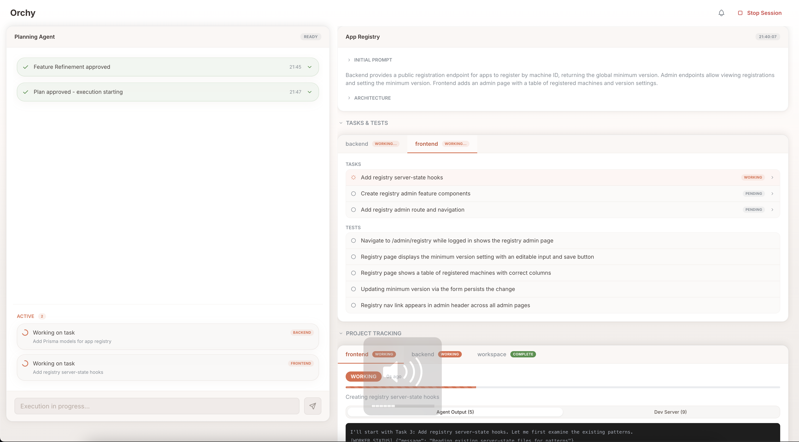
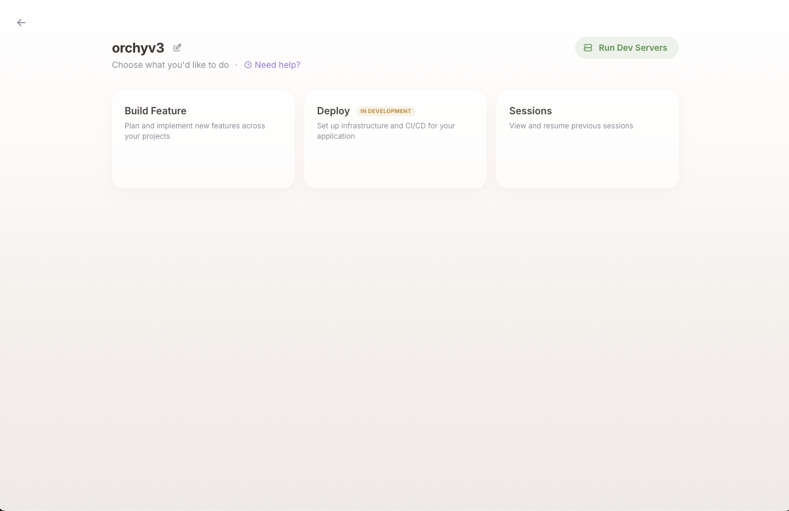
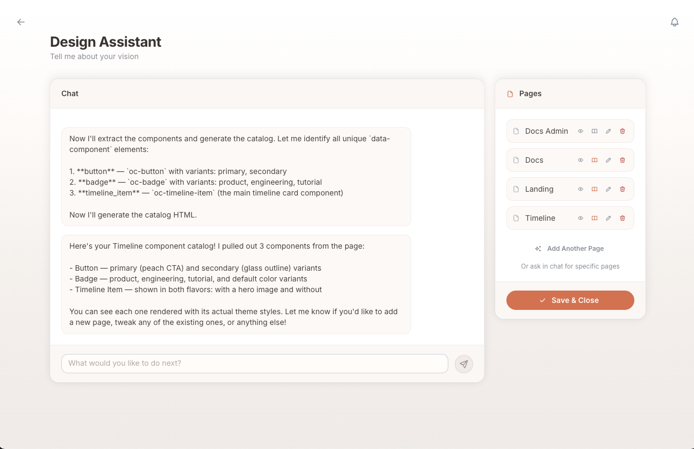

# Orchy

> Multi-agent orchestrator for Claude Code

Orchy lets you describe what you want to build and handles the rest: an AI planning agent refines your feature, explores your codebase, generates a detailed implementation plan, and then coordinates multiple Claude Code agents to execute the work across your projects — all while you stay in control through an interactive web UI.



---

## Key Features

- **Build Mode** — Describe a feature in plain English. A planning agent breaks it down into tasks, then multiple Claude Code agents implement it across your projects in parallel.
- **Design Mode** — Create a full design system through an interactive chat: color palettes, typography, component styles, and full-page HTML mockups — before writing any code.
- **Deployment Mode** — Provision cloud infrastructure, set up CI/CD pipelines, and deploy your projects through an AI-guided workflow.

<p>


</p>
- **Multi-project workspaces** — Manage frontend, backend, and fullstack projects in a single workspace with shared context.
- **Web UI** — Real-time session monitoring, task tracking, plan review and approval, all from your browser.
- **Project templates** — Scaffold new projects from built-in templates (Vite + React, NestJS, fullstack) or bring your own.
- **GitHub integration** — Automatic repository creation, branch management, and deployment workflows.

## Prerequisites

- **[Claude Code CLI](https://docs.anthropic.com/en/docs/claude-code)** — Orchy uses the Claude Code CLI to run AI agents. Must be installed and authenticated.
- **Git** — Required for version control features.
- **GitHub CLI (`gh`)** — Optional. Required for GitHub integration (repo creation, secrets, deployment workflows).
- **Node.js 18+** — Required runtime.

## Installation

Install via Homebrew:

```bash
brew install orchyai/tap/orchy
```

Or download the binary for your platform from the [Releases](https://github.com/orchyai/homebrew-tap/releases) page.

## Usage

```bash
orchy
```

Orchy starts a local server (default port: 3456) and opens the web UI in your browser.

| Flag | Description |
|------|-------------|
| `--port <number>` | Use a specific port |
| `--no-browser` | Start without opening the browser |
| `--help` | Show help |

You can also set the port via the `ORCHESTRATOR_PORT` environment variable.

## Documentation

Full documentation is available in the [`docs/`](docs/) folder:

- **[Getting Started](docs/getting-started.md)** — Prerequisites, installation, first launch
- **[Quick Guide](docs/quick-guide.md)** — Design to implementation walkthrough
- **[Modes](docs/modes.md)** — Build, Design, and Deployment modes
- **[Workspaces](docs/workspaces.md)** — Creating and managing workspaces
- **[Building Features](docs/building-features.md)** — Starting features and planning
- **[Design Mode](docs/design-mode.md)** — Full design workflow
- **[Deployment](docs/deployment.md)** — Providers, deployment workflow, credentials
- **[Troubleshooting](docs/troubleshooting.md)** — Common issues and solutions

See the [full table of contents](docs/README.md) for all topics.

## License

Proprietary. All rights reserved.
