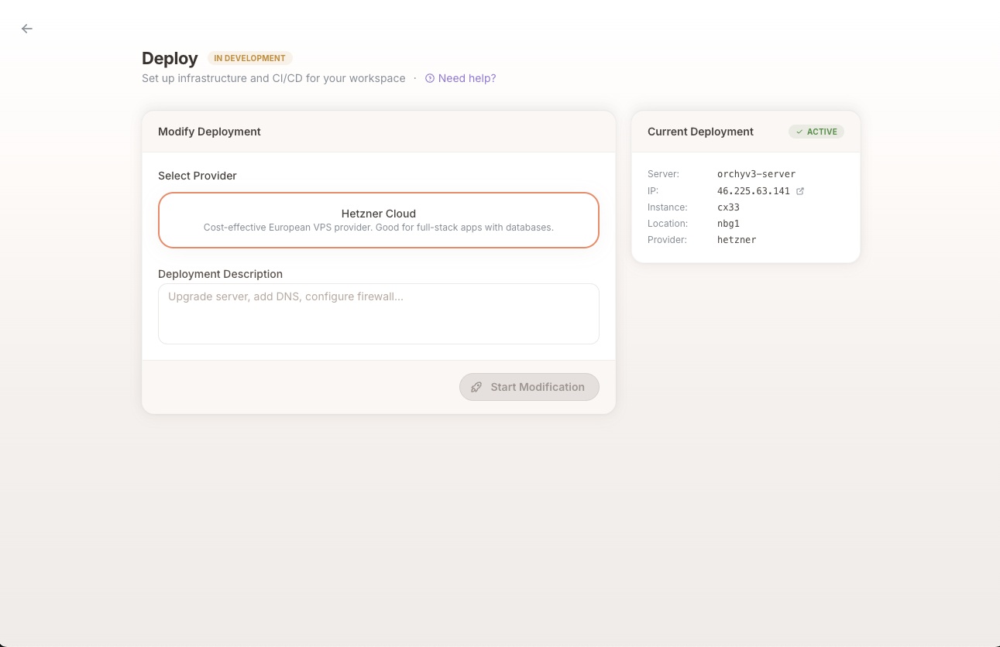

# Deployment

Orchy can provision cloud infrastructure and set up CI/CD pipelines for your projects.

---

## Requirements

Deployment requires:

- An **Orchy Managed** workspace (created from a template)
- **[GitHub integration](github-integration.md)** enabled with a connected repository

## Deployment Tab

When deployment is available, a **Deploy** tab appears alongside the Feature tab on the workspace screen.

## Supported Providers

### Hetzner Cloud

Cost-effective European VPS provider. Suitable for full-stack applications with databases.

**What you need:**
- A Hetzner Cloud API token (from console.hetzner.cloud → Security → API Tokens)
- The `hcloud` CLI installed locally
- Docker installed locally

## Deployment Workflow

1. **Select a provider** from the available options
2. **Describe your deployment** — what you want deployed, any special requirements
3. **Start Deployment Planning** — launches a deployment session

The deployment agent handles two phases:

### Phase 1: Infrastructure Provisioning

The agent provisions your server:

- Creates an SSH deploy key
- Creates a cloud server with Docker pre-installed
- Copies deployment configuration to the server
- Sets up environment variables
- Validates the infrastructure
- Stores GitHub secrets for CI/CD

### Phase 2: CI/CD Setup

The agent creates a GitHub Actions workflow that:

- Builds Docker images from your projects
- Pushes images to GitHub Container Registry (GHCR)
- Deploys to your server automatically on push to main

## Credentials & Prompts During Deployment

During deployment, Orchy may ask you for credentials or confirmations through overlay prompts:

- **CLI verification** — Confirms required tools are installed (e.g., `hcloud`, `docker`). If a tool is missing, you'll see installation instructions and a **Verify** button to re-check.
- **API token** — Your cloud provider API token. Used locally by the agent during provisioning and stored as a GitHub secret for CI/CD.
- **Confirmation** — Yes/no prompt before actions that incur costs (e.g., provisioning a server).

Orchy never stores credentials locally beyond the current session. GitHub secrets are set via the `gh` CLI. SSH keys generated during deployment are stored as GitHub secrets for CI/CD use.

## Existing Deployments

Once deployed, the Deploy tab shows your current infrastructure:

- Server name and IP address
- Instance type and location
- Provider information

You can start a **Modification** session to make changes to existing infrastructure (upgrade server, add DNS, configure firewall, etc.).
